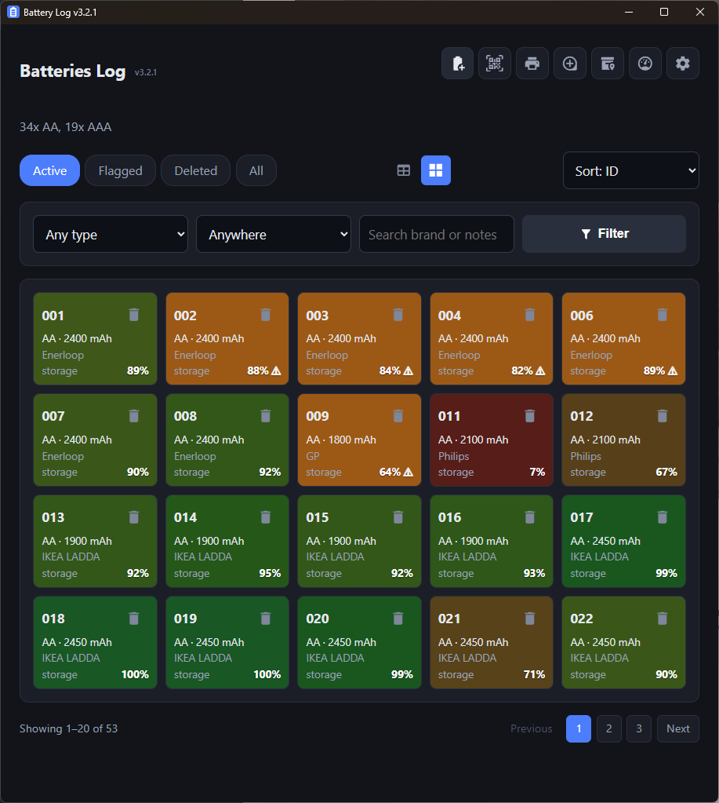
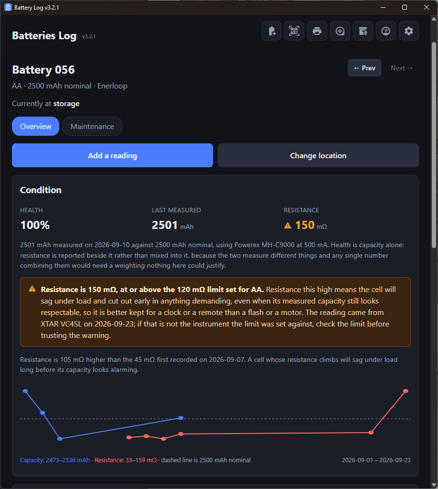
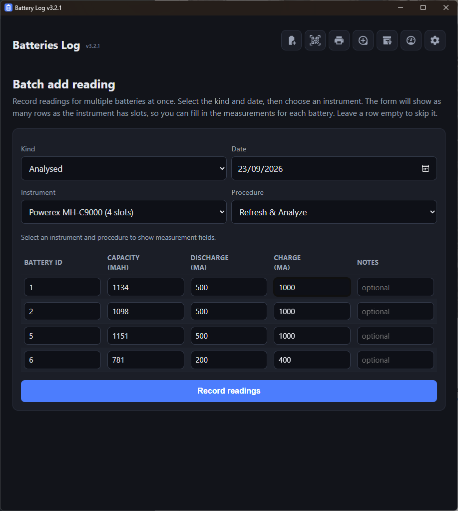
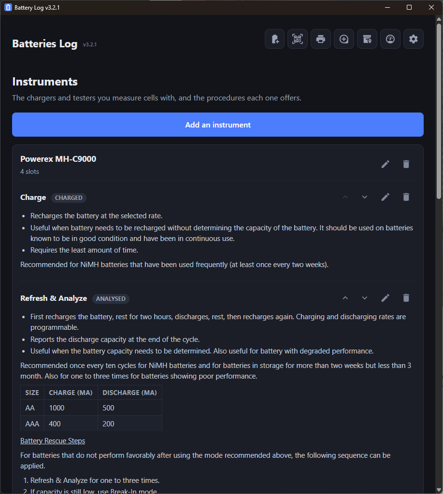

# Battery Log


[](LICENSE)
[](https://claude.com/claude-code)

A Windows desktop app for tracking a personal collection of rechargeable
batteries: each cell gets a number, a printed label carrying that number as
a Data Matrix code, and a row in a local SQLite database saying what it is,
where it lives, and how it's holding up.

Built with Tauri: a Rust backend with its own local SQLite database, and a
thin HTML/CSS/JS frontend running in the OS's native webview.

|  |  |
|---|---|
|  |  |
|  |  |

## What it does

The point is to know, for every rechargeable cell you own, what it is, where
it is, and how good it still is.

### Batteries

Every cell gets an id and a record: type (`AA`), brand, nominal capacity
(mAh), location and notes. Only the type is required. Add one, or many at
once with **How many**, and optionally print the labels on save.

Ids are three digits (1–999). An id that has been used stays taken even after
its battery is deleted, so a printed label can never come to mean a different
cell. The only ways an id comes free are deleting the highest id when it has
never had a reading, or permanently deleting a deleted battery that never
had one.

The list shows them as a table or a grid, filtered by type, location or a
search of brand and notes, and sorted by id, type, location, health (worst
first) or resistance (highest first). Its filters are remembered.

### Labels

A label is a Data Matrix code carrying the id, with the id printed beside it.
It carries nothing else, so editing a battery's details never makes a label
wrong. Print from the Add page, from a battery's Maintenance tab (Reprint
label, or Preview label to save a PNG), or from the **Print** page, which
takes ids as `7`, `5,7,9`, `5-9`, or any mixture like `1, 3, 5-8, 12` and
shows what would print first. Ids that don't exist or are deleted are
skipped and named. Labels go to a Brother PT-E550W/P750W/P710BT over the
network, or to a PDF for any other printer — see Known limitations.

### Location

A location is free text, not a fixed list ("Case A", "TV remote"), with
your existing ones offered as suggestions. Every change is recorded in the
battery's location history. Change it from the battery's page, by scanning
its label on the Scan page, or for several at once on **Batch change
location**.

### Readings

A reading has a date and a kind:

- **bought** — the date only.
- **charged** or **analysed** — from an instrument (and usually one of its
  procedures), carrying any of: capacity (mAh), resistance (mΩ), discharge
  current, charge current and notes.

A capacity has to say what discharge current it was measured at, any value
has to say which instrument it came from, a reading needs at least one
value, and negative numbers are refused. Add readings from the battery's
page, from the Scan page, or for a whole charger's worth of cells at once on
**Batch add reading**, which offers as many rows as the chosen instrument has
slots.

### Condition and flagging

A battery's Overview page shows its condition:

- **Health** is capacity retention: the latest measured capacity as a
  percentage of the nominal one. Only *analysed* readings with a capacity
  count, and the battery needs a nominal capacity. It is deliberately never
  blended with resistance.
- **Only comparable readings make a trend.** Capacity from different
  chargers, or the same charger at different discharge currents, isn't
  directly comparable, so health follows the one *setup* (instrument plus
  discharge current) with the most readings. A newer reading from another
  setup is pointed out but doesn't take over until it becomes the longer
  series.
- **Resistance** is shown separately: the latest value, and how far it has
  moved from the first one recorded.
- A battery is **flagged** when its health is below `HEALTH_LIMIT_PCT`
  (default 80%), or its latest resistance is at or above the limit for its
  type (`IR_LIMIT_AA`, `IR_LIMIT_AAA`; defaults 100 and 200 mΩ). A type is
  matched by its first word, so `AA (Eneloop)` uses the AA limit and `AAA` is
  never mistaken for `AA`. Limits only exist for those two sizes because AA
  and AAA NiMH cells are by far the most popular; any other size or
  chemistry has its resistance recorded but not checked, and there's no
  setting to add a limit for one.
- A chart plots capacity (blue) and resistance (red) over time, with the
  nominal capacity as a dashed line. The list colours each row by health,
  from red to green with the health limit as the midpoint, and has a
  **Flagged** view.

### Retiring and reusing

- **Delete** marks a battery deleted; nothing is removed and **Restore**
  undoes it.
- **Clear record** empties everything about the cell — capacity, brand,
  location, notes, location history and every reading — but keeps the id and
  type and puts it back in use, for when a sticker goes onto a different cell.
- **Delete permanently** removes a deleted battery that never had a reading.

Instruments and procedures, scanning, and the settings are described in the
sections below.

## Architecture

A Cargo workspace, two crates:

- **`core/`** — `batteries-core`, a plain Rust library with no Tauri
  dependency: `db` (SQLite storage via `rusqlite`, bundled + WAL mode),
  `health` (capacity/resistance trend logic), `config` (settings resolution:
  database → environment → built-in default), `labels` (Data Matrix
  rendering, label rasterization, Brother P-touch network printing). Fully
  unit-testable on its own — `cargo test -p batteries-core`.
- **`src-tauri/`** — the desktop app, package name `battery-log` (binary
  `battery-log.exe`, lib `battery_log_lib`). No HTTP server, no listening
  socket. `router.rs` renders each "page" as an HTML fragment via **Tera**
  (pinned to 1.x — 2.x replaced macros with "components", which the
  templates here rely on) and returns it over IPC;
  `dist/app.js` is a small shell that swaps the returned HTML into
  `#app-content`, intercepts link clicks and form submits, and calls
  `invoke('render_page', ...)` / `invoke('submit_form', ...)` instead of
  doing a real navigation. `dist/` is otherwise plain HTML/CSS/JS — no
  bundler, no framework.

Pages are Tera templates (`src-tauri/templates/`) rendered to HTML fragments;
the frontend (`ui.js`, `scanner.js`, `batch.js`, `instruments.js`,
`markdown-editor.js`, `app.css`) is plain, unbundled vanilla JS/CSS.

**The version number has exactly one source**: `version` under
`[workspace.package]` in the workspace-root `Cargo.toml`. Both crates
inherit it (`version.workspace = true`), it's what `env!("CARGO_PKG_VERSION")`
embeds into the window title and the header's version text, and
`src-tauri/tauri.conf.json` deliberately has no `version` field of its own —
Tauri falls back to the Cargo package version when that field is absent. To
release a new version, edit the workspace `Cargo.toml` and nothing else.

## Building and running

Requires the Rust toolchain (rustup) and, on Windows, the WebView2 runtime
(preinstalled on any current Windows 10/11).

```powershell
cargo build -p battery-log
.\target\debug\battery-log.exe
```

If PowerShell says `cargo` isn't recognized, it's a `PATH` issue, not a
missing install: `%USERPROFILE%\.cargo\bin` only lands on `PATH` for shells
opened *after* the Rust installer ran, so a shell that was already open
needs to be reopened.

Release build (optimized, no debug symbols):

```powershell
cargo build --release -p battery-log
```

**Run the release exe from a local drive, not a network share.** The exe
carries its icon, but launched from a mapped or UNC network path Windows can
show a generic placeholder icon in the taskbar or no taskbar button at all,
while the identical file copied to a local folder gets the right icon and a
button straight away. If your checkout lives on a share, copy
`target\release\battery-log.exe` somewhere local to run it, or use the
installer below, which installs locally. The database location doesn't
depend on where the exe is.

## Running the tests

Tests do **not** run automatically as part of `cargo build` — that only
compiles. They have to be run explicitly, and they're not run as part of any
CI/build step in this project (there is no CI configured), so it's on you to
run them before trusting a change:

```powershell
cargo test -p batteries-core       # db, health, labels, PDF output
cargo test -p battery-log          # router.rs behavior, see below
cargo test --workspace             # both, in one call
```

There are two independent test suites:

- **`core/tests/`** (`cargo test -p batteries-core`) — unit/integration tests
  against `batteries-core` directly: database CRUD and delete/restore
  semantics, health-score golden values, Data Matrix encode/decode and
  rasterization, the structure of the PDF output, and the byte-level pieces
  of the printer protocol (raster-line packing, PackBits compression, the
  mode-setting commands).
- **`src-tauri/tests/router_tests.rs`** (`cargo test -p battery-log`) —
  calls `render_page`/`submit_form` the exact same way `dist/app.js` does
  over IPC, against a throwaway `tempfile::tempdir()` database per test, and
  asserts on both the resulting database state *and* the actual rendered
  HTML the webview would receive (e.g. "does the Deleted filter pill appear
  once something is deleted", not just "is the row in the database"). Most
  tests are named regression tests for a specific bug hit during
  development, the rest pin down a feature's behavior — see the comments in
  that file. Because every test opens its
  own temp database, none of this ever touches the real
  `%APPDATA%\com.batteries.log\batteries.db`.

Neither suite drives the actual webview or runs any client-side JavaScript
(`app.js`'s form interception, `confirm_dialog`, `ui.js`'s dynamic
show/hide) — both work by calling the same Rust functions the webview calls,
directly, and checking their return value. A change to `dist/*.js` isn't
covered by either suite and still needs a manual check in the running app.

An installer:

```powershell
cargo tauri build
```

Produces both `target\release\bundle\msi\Battery Log_<version>_x64_en-US.msi`
and `target\release\bundle\nsis\Battery Log_<version>_x64-setup.exe` — Tauri
downloads and bootstraps the WiX toolset and NSIS itself on first run, no
separate install needed. This has been run successfully once; it isn't part
of the normal edit/test loop (a full release build plus both bundlers takes
several minutes), so reach for `cargo build -p battery-log`/`--release` day
to day and only run this when you actually want an installer.

## Where your data is

`%APPDATA%\com.batteries.log\batteries.db` (plus its `-wal`/`-shm` SQLite
sidecar files — normal WAL-mode working files, not separate data). Ordinary
SQLite, openable with any SQLite tool. The same folder also holds
`.window-state.json`, where the window's last size and position are kept —
it isn't part of the database, so exporting, importing and restoring a
backup never touch it.

Setting the `BATTERY_LOG_DATA_DIR` environment variable to a folder moves
both the database and that file there instead, which is how to run a
throwaway instance for testing without going near your real data (also set
`WEBVIEW2_USER_DATA_FOLDER` to move the browser engine's own profile). It
must be set before the app starts, and the folder is created if missing.

The app identifier (`com.batteries.log`, in `tauri.conf.json`) fixes this
path — renaming it moves where the app looks for its database, so don't
rename it casually. It was changed once already, from `com.batteries.app`
to `com.batteries.log`, to avoid a macOS bundle-identifier conflict; a
one-time migration moved the existing install's data across automatically
and has since been removed from the code, having served its purpose.

**Importing an existing database** (a `batteries.db` file from a backup or
another install): Settings →
Import a database → pick the file → confirm. This replaces every battery,
instrument and reading currently in the app; it closes and reopens the live
connection safely, so quitting the app first isn't necessary. **Exporting**
(Settings → Export the database) writes a consistent snapshot via SQLite's
own backup API, safe to run while the app has the database open.

You can also swap `batteries.db` by hand while the app is **fully closed** —
delete the `-wal`/`-shm` files alongside it too, or a stale WAL can conflict
with the new file.

## Day-to-day use

A few notes on behavior beyond what's under "What it does" above:

- **No scanning via camera or URL.** A hardware barcode scanner in
  keyboard-wedge mode (types digits + Enter) is the only scan path; there's
  no browser involved and no camera support.
- **A desktop-sized window and layout.** The first time it runs, the window
  opens at half the width of the screen it lands on and the full height of
  its work area (so the taskbar stays clear), centred horizontally; after
  that it remembers its size, position and maximised state between runs
  (`.window-state.json`, kept next to the database — delete it to get the
  half-screen default back). The page fills whatever width the window has.
  `tauri.conf.json`'s 1100x800 is only the fallback if the screen can't be
  read. In the grid layout, **Batteries per row** (Settings) is a maximum, so
  raise it (up to 8) to use a wide window.
- **Label handling is preview-then-save, not a browser download.** "Preview
  label" renders the Data Matrix + id in a popup with a "Save as…" button
  that opens a native Save dialog.
- **An empty deleted battery can be removed permanently.** If a battery has
  never had a reading recorded against it, its deleted-battery page offers
  "Delete permanently" in place of "Clear record" (which stays available for
  a deleted battery that *does* have data). This is separate from the
  highest-id-with-no-readings auto-hard-delete on the very first delete —
  that one still applies unchanged.
- **Capacity/resistance/discharge/charge reject negative numbers**, with the
  typed values preserved on error rather than reset.
- **List filters, search and sort are remembered permanently** (stored in the
  `settings` table under `list_filters`), including across restarts and
  across navigating away to another page and back.
- **Confirmation dialogs are real native Windows dialogs**, not
  `window.confirm()` — the latter never displays anything in this webview.
  Continue/Cancel, blocking.

### The list

The line under the page title tallies what's listed: `3x AA, 5x AAA` — the
active batteries of each type (respecting any location or search filter).
Once the list is filtered by type it turns into that type's status instead:
`3x active, 2x flagged, 2x deleted`, counting across every status whichever
of Active/Flagged/Deleted/All is selected; flagged and deleted are left out
when there are none. The Active/Flagged/Deleted/All pills only appear once
there's something flagged or deleted to tell apart.

### Scanning

A scanner in keyboard mode types the id and presses Enter (some send CR LF,
i.e. Enter twice; everything below tolerates that).

- **Scan page:** Enter files the cell (Location) or logs a reading (Reading).
  The **Open** button goes to the battery's own page instead.
- **Batch add reading:** Enter in a battery id field moves to the next id
  field rather than submitting, so a whole charger's worth of cells can be
  scanned in a row. Enter in the last id field just stays put — the form is
  only ever submitted with its button. An empty field ignores Enter, so a
  second Enter from a CR LF can't skip a slot; use Tab to skip one on purpose.
- **Batch change location:** Enter in the Ids field appends a comma instead of
  submitting, so each scan lands after the last: `020,021,022,`. Fill in the
  location and press Enter there (or click the button) to move them.

## Instruments and procedures

The Instruments page lists every charger and tester used to measure a cell,
and the procedures each one offers. It's an information page rather than a
configuration one: it shows what the bench has and what each procedure
involves, and the forms for changing any of that stay behind their own
buttons until they're wanted.

A reading names an instrument and a procedure from a dropdown rather than
typing them, so it can only ever point at something that exists. Renaming
anything there never changes a reading that already used it — readings point
at instruments and procedures by id, not by name. An instrument's **slots**
is how many cells it holds at once, which is what the Batch add reading page
uses to offer the right number of rows once that instrument is chosen.

## Configuration

Each setting resolves in three layers: database override → environment
variable → built-in default. Edit overrides from the Settings page, or set
the environment variable below directly:

| Variable | Default | Meaning |
| --- | --- | --- |
| `PTOUCH_HOST` | unset | Address of a network P-touch. Port 9100. |
| `PTOUCH_USB` | unset | Set to `1` for a USB printer — **not implemented**, see below. |
| `TAPE_MM` | `9` | Loaded tape width: 3.5, 6, 9, 12, 18 or 24. |
| `PAGE_SIZE` | `25` | Batteries shown before the list pages. |
| `LIST_VIEW` | `table` | Layout of the battery list: `table` or `grid`. |
| `GRID_COLUMNS` | `3` | Most tiles per row in the grid layout, 1 to 8. |
| `ID_TEXT_SCALE` | `0.40` | Height of the printed id, as a fraction of the tape. |
| `CHAIN_LABELS` | `1` | Chain print when more than one label is sent at once. |
| `HALF_CUT` | `1` | When multiple labels print as one batch, half-cut (score, don't fully separate) between them instead of a full cut. Off cuts all the way through; either way the batch still prints as one job. No effect on a single label, which always gets a full cut. |
| `PRINT_ON_ADD` | `1` | Print labels when adding batteries, by default. |
| `LABEL_OUTPUT` | `printer` | `printer` sends labels to the network printer above; `pdf` saves them to a file via a native Save dialog instead, everywhere a label is printed (add, reprint, batch print). |
| `PDF_LAYOUT` | `pages` | Only matters when `LABEL_OUTPUT` is `pdf` and more than one label is saved at once: `pages` gives each label its own exactly-sized page, `grid` tiles several onto A4 sheets. |
| `HEALTH_LIMIT_PCT` | `80` | Capacity retention below which a cell is flagged. |
| `IR_LIMIT_AA` / `IR_LIMIT_AAA` | `100` / `200` | Resistance limit (mΩ) per cell size. |

There's no `PORT` to configure — no server to bind one — and no font-path
setting: label text uses `ab_glyph` against a font baked into the binary,
not a system font lookup.

## Known limitations

- **USB printer support is not implemented.** `PTOUCH_USB` is accepted as a
  setting but printing over USB returns an explicit "not implemented yet"
  error. Network printing is implemented and confirmed working on real
  hardware (a PT-P750W), both
  single-label and multi-label/batch, chained and not.
- **Printer support is specific to one Brother model family, not "Brother
  printers" generally, and not other brands at all.** The raster protocol in
  `core/src/labels.rs` is implemented directly from Brother's own official
  *Software Developer's Manual: Raster Command Reference,
  PT-E550W/P750W/P710BT* — every constant that depends on the physical print
  head (`head_layout`'s pin counts and per-tape-width margins) comes from
  that document and is only known to be correct for that exact family.
    - **Other Brother PT-series models** (P700, D600, etc.) *might* work if
      they happen to share the same 128-pin head, since Brother groups
      several small label makers into shared-hardware-generation manuals —
      but this hasn't been checked against any of their specs, and a
      mismatch here reproduces the exact "prints short and blank" bug this
      version just fixed, for a different underlying reason.
    - **Brother QL-series printers** (QL-800 and similar) speak a related
      but distinct protocol variant — same command names (`ESC i a`,
      `ESC i z`, `G`, ...) but a different physical head width, margin
      table, and media/tape-ID scheme. Would need its own layout table to
      work; untested and not expected to work as-is.
    - **Brother PT-P900/P900W** has its own separate official command
      reference — different, unconfirmed head geometry again.
    - **Non-Brother printers** (Dymo, Zebra, etc.) will not work at all —
      these use entirely different, unrelated protocols (Zebra's ZPL/EPL,
      Dymo's own command set), not a variation on this one.
  If you're on a different printer than a PT-E550W/P750W/P710BT, switch
  Settings → Label output to **PDF** — every print action (add, reprint,
  batch print) then opens a native Save dialog instead of sending to the
  network printer, and you print the resulting file through whatever
  software came with your own printer. `Settings → PDF layout` controls
  whether a multi-label save gets one exactly-sized page per label or
  several tiled onto A4 sheets. Label preview → **Save as…** (PNG) remains
  available too, for a single label at a time.
- **Battery ids stop at 999.** Labels carry the id as three digits so every
  label comes out the same size, and adding or printing anything higher is
  refused. Raising the cap means changing `MAX_ID` and `PAYLOAD_MIN_DIGITS`
  together in `core/src/labels.rs`; labels already printed keep working,
  because leading zeros are ignored when a code is read.
- **Unsigned executable.** Windows SmartScreen will warn on first run. Only
  fixable with a real code-signing certificate; no code change addresses it.
- **macOS is unbuilt and untested.** The plan kept the door open (no
  Windows-only crate choices, a per-OS font-path table already exists in
  `core::labels`) but nothing has been compiled or run there. The identifier
  no longer blocks this (`com.batteries.log` doesn't have the `.app`-suffix
  conflict `com.batteries.app` used to warn about) — this is otherwise
  unblocked whenever there's a Mac to actually try it on.

## Backups

Use Settings → Export the database for a consistent snapshot while the app
is running, or copy `batteries.db` directly while the app is closed. Both are
ordinary SQLite files, restorable by placing them back at
`%APPDATA%\com.batteries.log\batteries.db` (app closed, `-wal`/`-shm` files
alongside removed).

## To do

- **Integrated auto-updater**, via `tauri-plugin-updater`. The installer
  prerequisite is done (`cargo tauri build` works — see "Running the tests"
  above); still needed: an updater signing keypair (`tauri signer
  generate` — separate from a Windows code-signing cert), somewhere to host
  the update manifest + release bundles (GitHub Releases or a server of your
  own), and a check-for-updates trigger in the UI (on launch, on a
  schedule, or a manual button on Settings). Doesn't fix the SmartScreen
  warning — that's a separate, code-signing-only problem.
- **Editing a reading.** A reading can only be deleted and entered again;
  there's no edit form for one, though a battery's own details (type, brand,
  nominal capacity, notes) are editable.
- **CSV / spreadsheet import and export.** Only the whole database can be
  exported or imported (as SQLite). Importing a spreadsheet would make it
  much easier to bring in a collection tracked elsewhere, and exporting
  readings as CSV would make them usable in other tools.
- **Automatic backups.** Backups are manual (Settings → Export the
  database); a scheduled or on-quit copy would remove the need to remember.
- **More reading kinds.** A reading is one of *bought*, *charged* or
  *analysed*. There's no kind for a plain voltage check or a self-discharge
  test.
- **A light theme.** The interface is dark only; there's no light theme and
  it doesn't follow the operating system's setting.
